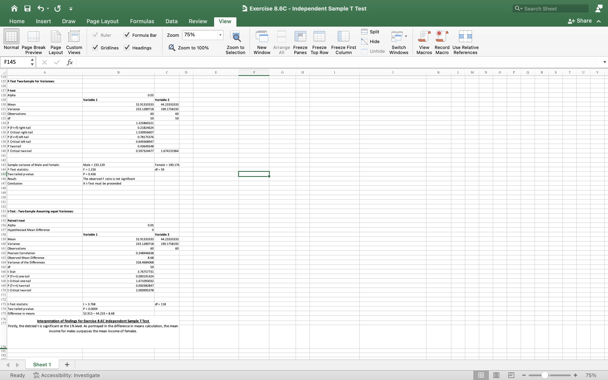
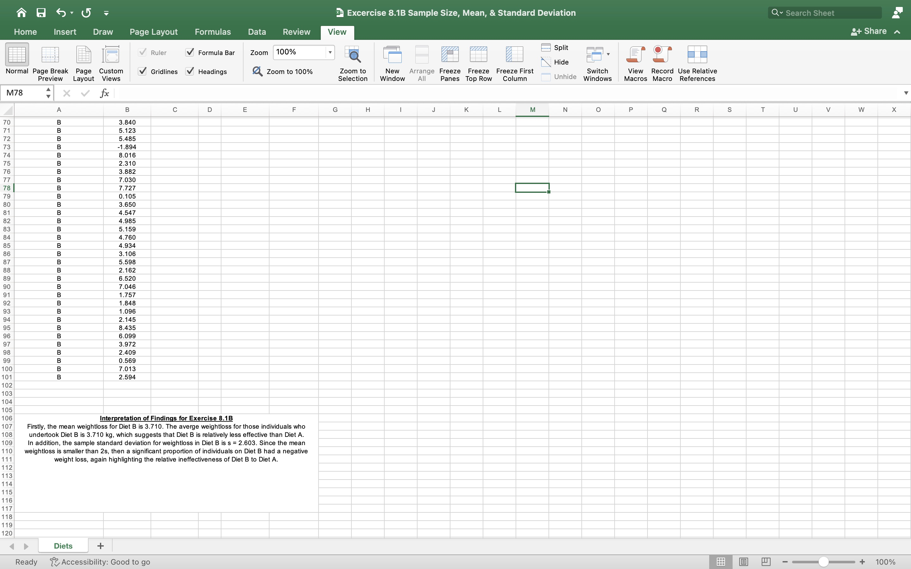
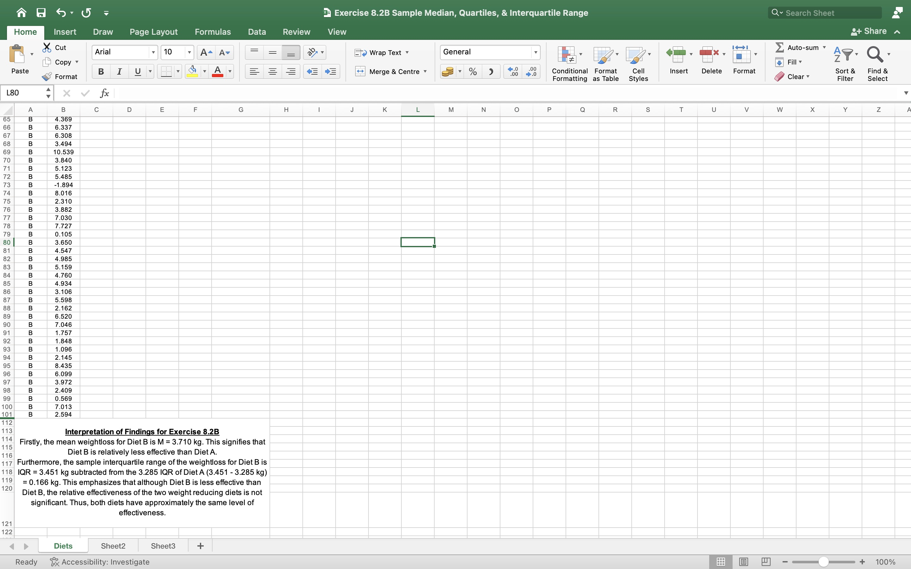
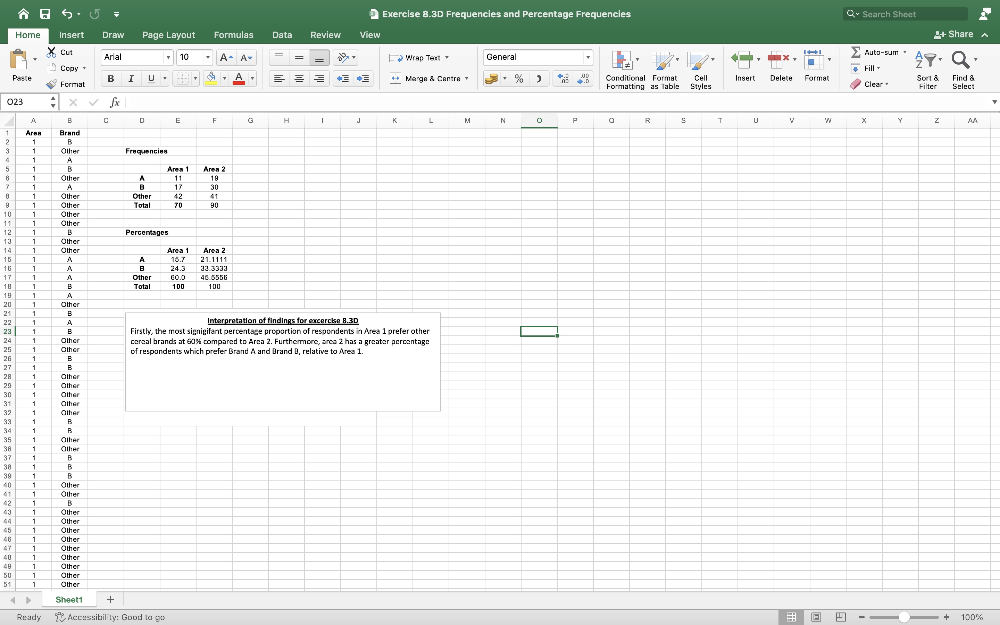
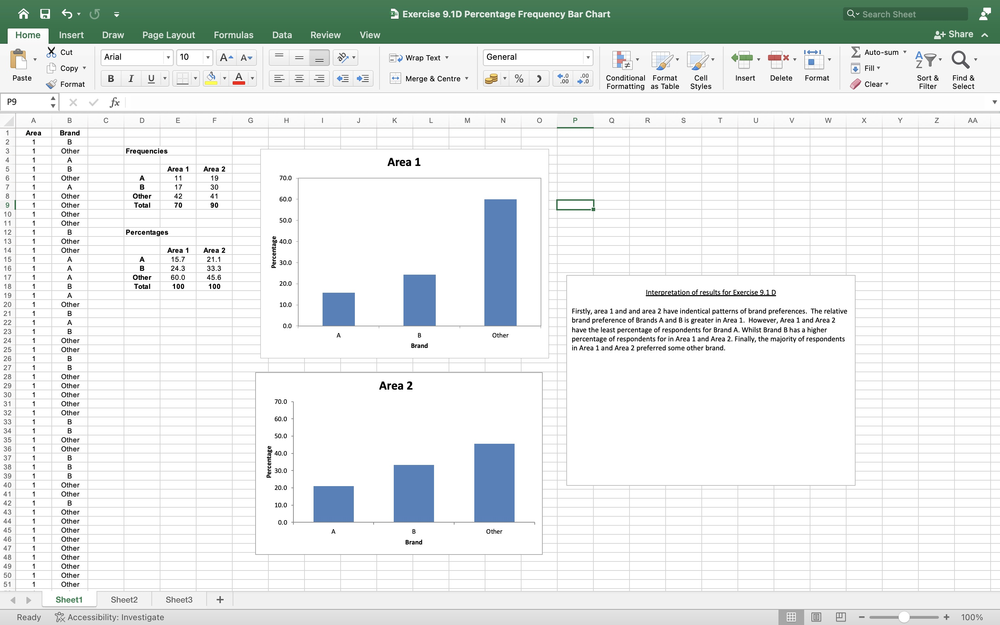
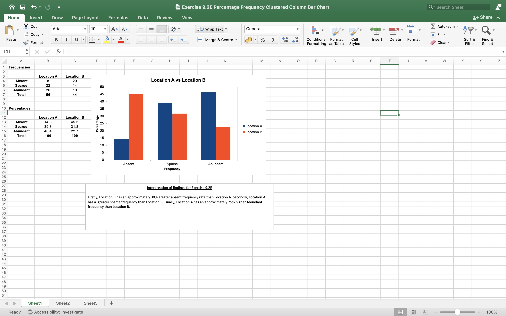
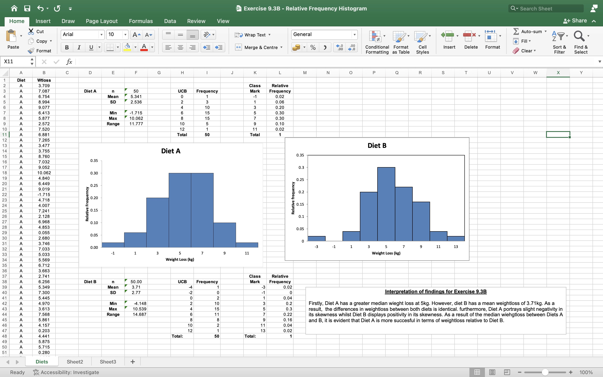
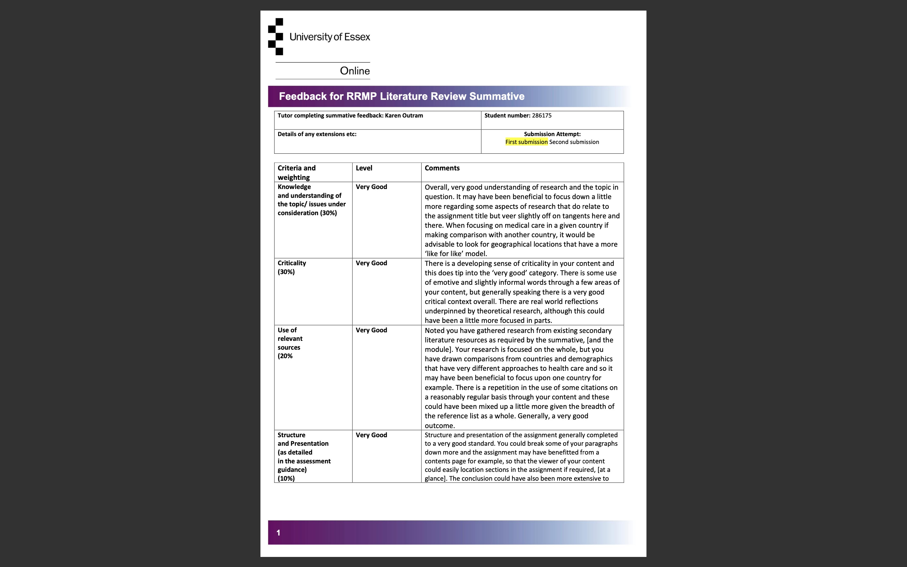
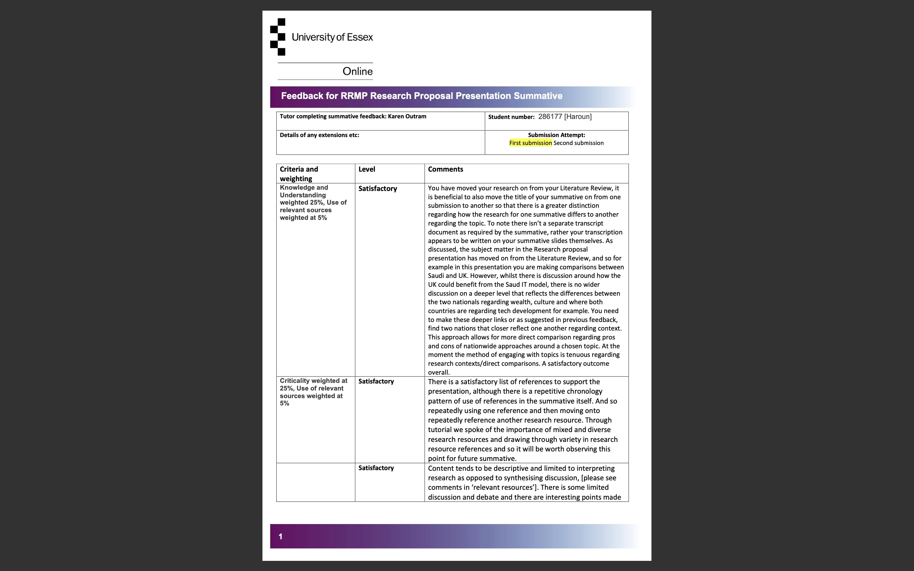

## University of Essex MSc Cyber Security Academic E-Portfolio

---

### Research Methods and Professional Practice ###  

[Summary of Learning Outcomes](/Outcomes.md)

### Collaborative Learning Discussions ### 
[Codes of Ethics and Professional Conduct](/disc1.md)

[Case Study: Accuracy of information](/scan.md)

---

### Literature Review and Research Propsal Outlines ###

[Literature Review Outline](/evaluation.md)

[Research Proposal Outline](/design.md)

---

### Summary Measures and Hypothesis Testing Worksheets ###

### One tailed Test and Two Tailed Test ###

### Independent Sample T Test ###

### Sample Size, Mean, and Standard Deviation ###

### Sample Median, Quartiles, and Interquartile Range ###

### Frequencies and Percentage Frequencies ###

### Charts Worksheet ###

### Percentage Frequency Bar Chart ###

### Percentage Frequency Clustered Column Bar Chart ###

### Relative Frequency Histogram ###

---

### Reflections  ###

[Individual Unit Reflections](/exec.md)

---

### Feedback from Tutor  ###

### Literature Review Feedback  ###

### Research Proposal Presentation Feedback  ###

---

Page template forked from <a href="https://github.com/evanca/quick-portfolio">evanca</a>

<!-- Remove above link if you don't want to attibute -->
